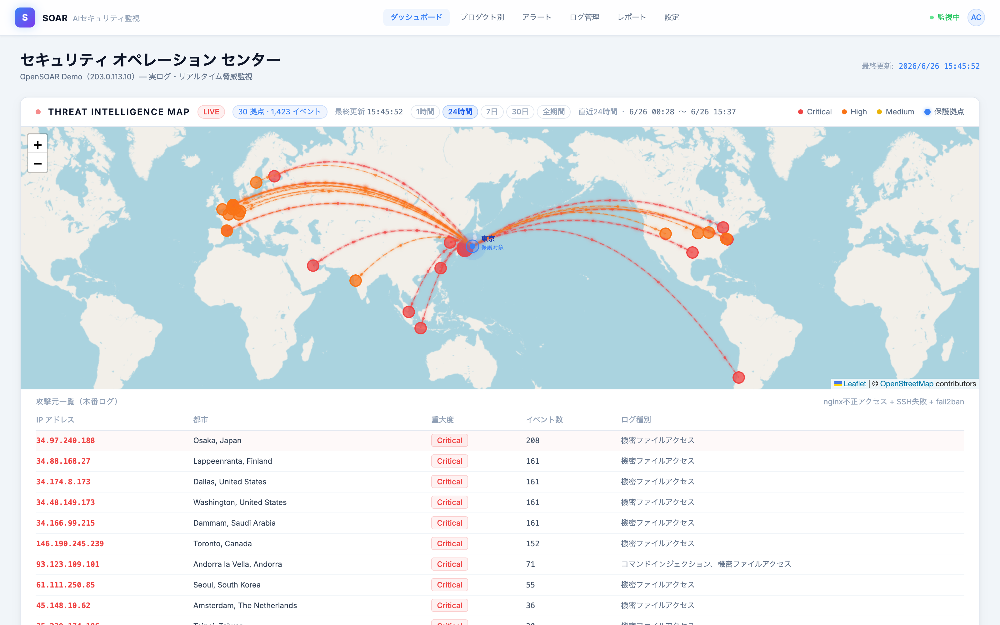
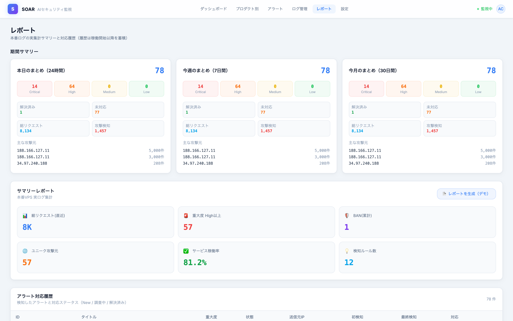

# OpenSOAR

> 実ログで動く、セルフホスト型のリアルタイム脅威監視ダッシュボード

**[English](README.en.md)** | **日本語**


[](https://soar-demo.1qaz.jp)

> **🔗 ライブデモ: [soar-demo.1qaz.jp](https://soar-demo.1qaz.jp)** — 実サーバへの攻撃をリアルタイムに可視化した公開インスタンスです。データは匿名化しています（攻撃元IPは下位2オクテットを伏字、ドメイン・製品名・環境名はマスキング、書き込み操作は無効）。

サーバの **nginxアクセスログ・SSHログイン失敗・fail2ban** を集計し、世界地図に
「攻撃元 → 自サーバ」をリアルタイムに描画する、軽量な **SOAR 風**セキュリティダッシュボードです。

> 🛰️ **サンプルデータではなく、実際のログを可視化します。** 攻撃元IPはGeoIPで地図にプロットされ、
> アラートは履歴DBに蓄積、日次/週次/月次でサマリー表示します。AIによる要約チャットも内蔵（任意）。

---

## ✨ 特徴

- 🗺️ **Threat Intelligence Map** — 攻撃元IPをGeoIPで世界地図にプロットし、自サーバへの攻撃を弧アニメで可視化
- ⏱️ **期間セレクタ** — 直近 `1時間 / 24時間 / 7日 / 30日 / 全期間` を切替（既定24時間）。対象期間の最古〜最新も表示
- 🚨 **アラート** — 不審リクエストをIP別に集約し、重大度・AI要約・推奨対応・実ログのタイムラインを生成。`重大度順 / 新しい順` 切替、調査中/解決のステータス管理（履歴DB永続化）
- 📦 **プロダクト別ビュー** — サイト（vhost）ごとに「どんな攻撃が来ているか」を集計
- 📈 **レポート** — 本日 / 今週 / 今月のサマリーとインシデント対応履歴
- 🤖 **AI要約チャット** — アラートの文脈を踏まえて質問に回答（OpenAI互換。Ollama/Azure/vLLM等に差し替え可。**任意**）
- 📧 **メール通知** — 重大アラート（既定 Critical）を cron でダイジェスト送信
- 🌐 **複数サーバ連携** — 読取専用の forced-command 鍵でリモートのログを集約し、1枚の地図に統合
- 🔐 **任意の内蔵認証** — メールOTP + JWT。`/api/*` をログイン必須化＋ユーザー管理（既定OFF）
- 🪶 **軽量・セルフホスト** — 追加のミドルウェア不要。標準のログ + systemd だけで動作

---

## 🏗️ アーキテクチャ

```
                       ┌──────────────── あなたのサーバ ────────────────┐
ブラウザ ──/──> nginx ─┤  /api/* → FastAPI backend (:8004)               │
        (Basic認証等)   │            ├─ 実ログ集計 (nginx / SSH / fail2ban)│
                       │            ├─ GeoIP (ip-api.com 等)             │
                       │            ├─ SQLite (アラート履歴 / GeoIPキャッシュ)│
                       │            └─ AI要約 (OpenAI互換, 任意)          │
                       │  /     → Next.js frontend (:3002)               │
                       │            └─ Leaflet 地図 / ダッシュボード        │
                       └────────────────────────────────────────────────┘
                            ▲ 任意: 複数サーバのログを pull して集約
```

- **backend** [`security-monitor/backend/`](security-monitor/backend/) … FastAPI。nginx/SSH/fail2ban/systemd を集計し JSON で配信
- **frontend** [`soar/`](soar/) … Next.js 14 + react-leaflet。`/api/*` をポーリング表示

---

## 🖼️ スクリーンショット

**ダッシュボード — Threat Intelligence Map**



実ログから攻撃元IPをGeoIPで世界地図にプロットし、攻撃元一覧を重大度つきで表示。期間は `1h〜全期間` で切替。

**レポート — 期間サマリー & 対応履歴**



本日/今週/今月の集計（重大度内訳・解決/未対応・総リクエスト・主な攻撃元）と、アラート対応履歴。

> ※ デモ表示のため保護対象のホスト名・IPは伏せています（`203.0.113.10` は RFC5737 のドキュメント用IP）。攻撃元IPは実際の探索アクセス元です。

---

## 📋 必要環境

- **Linux**（Ubuntu系で検証）。nginx の **combined形式**アクセスログ
- **Python 3.12+** / **Node.js 18+**
- 任意: `fail2ban` `systemd`（無くても動作。該当パネルが空になるだけ）
- 任意: OpenAI APIキー（AIチャット用。未設定ならチャットは自動で無効）

---

## 🚀 クイックスタート

```bash
# 1) backend
cd security-monitor/backend
python3 -m venv venv && ./venv/bin/pip install -r requirements.txt
cp .env.example .env                       # 編集（SOAR_PROTECTED_HOST / 緯度経度 / 任意でOPENAI_API_KEY）
cp services.example.json services.json     # 任意: 監視するsystemdサービス一覧を編集（未設定なら汎用既定）
./venv/bin/uvicorn main:app --host 127.0.0.1 --port 8004

# 2) frontend
cd soar
npm install
npm run dev                                # http://localhost:3002 （/api は :8004 へ自動proxy）
```

本番は `npm run build && npm start` ＋ nginx で `/api/` を `127.0.0.1:8004` にproxyし、
**Basic認証など何らかのアクセス制御を必ず前段に置いてください**（下記セキュリティ参照）。

---

## ⚙️ 設定（主要な環境変数）

| 変数 | 用途 |
|---|---|
| `SOAR_SITE_NAME` / `SOAR_PROTECTED_HOST` | 監視対象の表示名・IP |
| `SOAR_DEFENDER_LAT/LON/LABEL` | 地図の着弾点（自サーバ所在地） |
| `SOAR_SERVICES_FILE` | 監視サービス一覧JSON（既定: `services.json`。未設定なら汎用既定） |
| `SOAR_DEFAULT_WINDOW` | 地図の既定対象期間（`1h`/`24h`/`7d`/`30d`/`all`） |
| `SOAR_DATA_DIR` | SQLite保存先（既定: ソース同階層） |
| `OPENAI_API_KEY` / `SOAR_CHAT_MODEL` / `OPENAI_BASE_URL` | AIチャット（任意。Ollama等も可） |
| `GEOIP_BATCH_URL` | GeoIPエンドポイント（既定 ip-api.com） |
| `SOAR_ALERT_EMAIL` / `SOAR_ALERT_SEVERITIES` | メール通知先・対象重大度（既定 Critical） |
| `SOAR_REMOTE_ENVS` / `SOAR_REMOTE_DIR` | 複数サーバ連携（`pull_remote.sh`） |
| `SOAR_REQUIRE_AUTH` / `JWT_SECRET` / `SOAR_ADMIN_EMAIL` | 内蔵OTP/JWT認証（任意。既定OFF） |

全項目は [`security-monitor/backend/.env.example`](security-monitor/backend/.env.example) を参照。

---

## 🌐 複数サーバの連携（任意）

`pull_remote.sh.example` を `pull_remote.sh` にコピーし、リモートへ **読取専用の forced-command 鍵**
を登録 → cron で定期的にログをpull → ローカルキャッシュを集約します。リモート側 `authorized_keys`:

```
command="/home/USER/.ssh/soar-collect.sh",no-port-forwarding,no-pty,no-X11-forwarding ssh-ed25519 AAAA... soar-pull
```

これにより、複数サーバへの攻撃を **1枚の世界地図** に統合表示できます。

---

## ⚠️ セキュリティ注意（公開前に必読）

- **デフォルトはアプリ層認証OFF**（`SOAR_REQUIRE_AUTH=false`）。必ず nginx Basic認証 / VPN /
  信頼ネットワーク等を前段に置いてください。`uvicorn` は `127.0.0.1` バインド推奨。
- 任意で **メールOTP+JWT の内蔵認証** あり。`SOAR_REQUIRE_AUTH=true` で `/api/*` をログイン必須化
  （`JWT_SECRET` / SMTP / `SOAR_ADMIN_EMAIL` を設定）。前段認証との二重化も可。
- `OPENAI_API_KEY` を設定する場合は **認証を有効化してから**。`/api/chat` を野ざらしにすると
  API課金濫用の恐れ。
- GeoIP 既定の **ip-api.com は無料・非商用・平文HTTP・45req/分**。商用や高負荷では
  MaxMind GeoLite2 等のローカルDBへ `GEOIP_BATCH_URL` で切替を。
- `.env`・`*.db`（攻撃元IP・履歴を含む）・`services.json`（自インフラ一覧）・`pull_remote.sh`
  は `.gitignore` 済。**コミット前に `git status --ignored` で確認**してください。

---

## 🧱 技術スタック

- **Backend**: Python / FastAPI / uvicorn / httpx / SQLite（標準ライブラリ）
- **Frontend**: TypeScript / Next.js 14（App Router）/ React / react-leaflet / Tailwind
- **データ源**: nginx access log / `lastb`(btmp) / `fail2ban-client` / `systemctl`
- **GeoIP**: ip-api.com バッチ（差し替え可）

---

## 📄 ライセンス

[MIT](LICENSE) © 2026 Masafy
